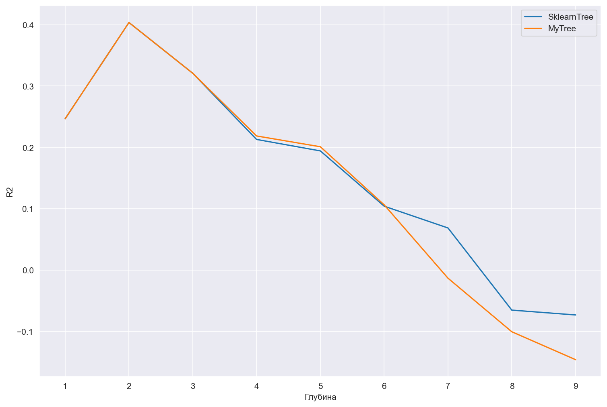
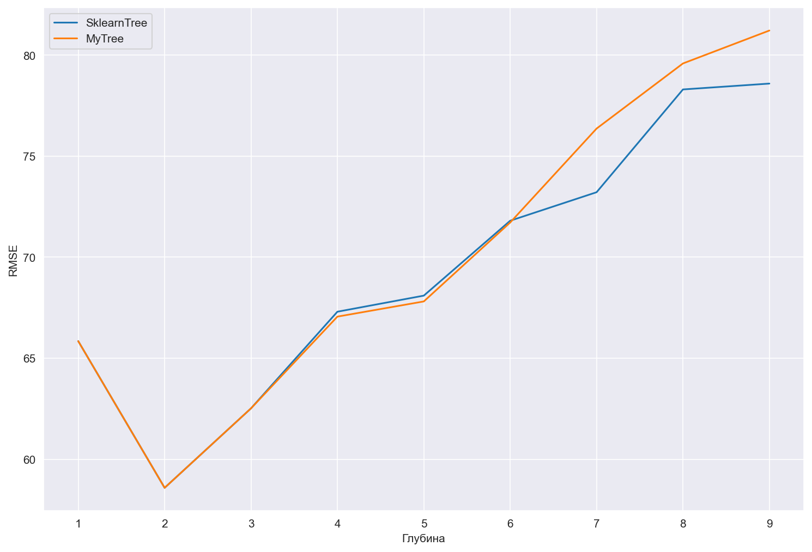

# Проект: Реализация дерева решений для регрессии с нуля (MyTreeReg)

## Введение

Проект реализует **регрессионное дерево решений (Decision Tree Regressor)** на Python без использования готовых библиотек машинного обучения.

Особенности реализации:

* Поддержка разбиений по признакам с **оптимальным порогом**, минимизирующим среднеквадратичную ошибку (MSE)
* Ограничения по глубине дерева, числу листьев и минимальному числу объектов для разбиения
* Поддержка **дискретизации признаков** через `bins` для ускорения обучения
* Подсчёт **важности признаков** на основе уменьшения MSE
* Простая и понятная реализация для обучения и визуализации процесса построения дерева решений

**Цель проекта:** изучить устройство регрессионных деревьев и реализовать их самостоятельно.
**Актуальность:** деревья решений — один из ключевых методов анализа данных и основа для ансамблевых алгоритмов (Random Forest, Gradient Boosting и др.).

---

## Теоретическая часть

### Модель регрессионного дерева

Алгоритм построения дерева:

1. На каждом узле ищется **наилучший признак и порог разбиения**, максимизирующие уменьшение MSE.
2. Данные разделяются на две группы по условию `feature <= split_value`.
3. Рекурсивно строятся **левое и правое поддеревья** до выполнения одного из условий остановки:

   * достигнута максимальная глубина (`max_depth`)
   * в узле меньше минимального числа объектов (`min_samples_split`)
   * достигнут лимит по количеству листьев (`max_leaves`)
4. Лист дерева хранит **среднее значение целевой переменной** в соответствующей группе объектов.

---

## Реализация (MyTreeReg)

Класс `MyTreeReg` поддерживает следующие параметры:

| Параметр          | Тип          | Описание                                      |
| ----------------- | ------------ | --------------------------------------------- |
| max_depth         | int          | Максимальная глубина дерева                   |
| min_samples_split | int          | Минимальное число объектов для разбиения узла |
| max_leaves        | int          | Максимальное число листьев                    |
| bins              | int или None | Количество бинов для дискретизации признаков  |

---

## Критерий разбиения

Для выбора лучшего разбиения используется уменьшение среднеквадратичной ошибки (MSE):

```
MSE(y) = (1/n) * Σ (y_i - ȳ)^2
```

* Чем **больше уменьшение MSE** после разбиения, тем лучше выбранный порог.
* Разбиение прекращается, если не удаётся найти улучшение.

---

## Ограничения дерева

* **max_depth** — предотвращает переобучение за счёт ограничения глубины.
* **min_samples_split** — защищает от разбиения на слишком малых выборках.
* **max_leaves** — ограничивает размер дерева по количеству листьев.

---

## Важность признаков

Важность признака вычисляется как **суммарное уменьшение MSE**, которое дало его использование при построении дерева:

* Признаки с большим вкладом важнее для модели.
* Это позволяет проводить **интерпретацию и отбор признаков**.

---

## Предсказание

* `predict(X)` — возвращает предсказанное среднее значение целевой переменной для каждого объекта.
* Обход дерева выполняется рекурсивно: от корня до соответствующего листа на основе условий `feature <= split_value`.

---

## Сравнение собственной и встроенной реализаций

* **Максимальная глубина** — 5
* **Максимальное количество листьев** — 20
* Для удобства R2 был умножен на 100


## Зависимость R2 от глубины дерева



## Зависимость RMSE от глубины дерева



## Зависимость R2 от количества листьев


## Зависимость RMSE от количества листьев


